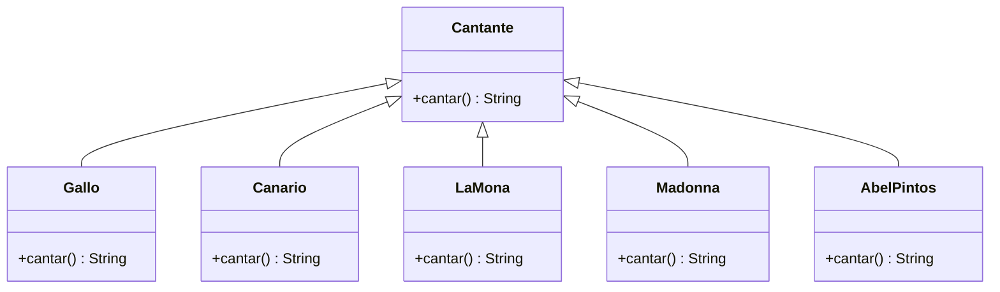
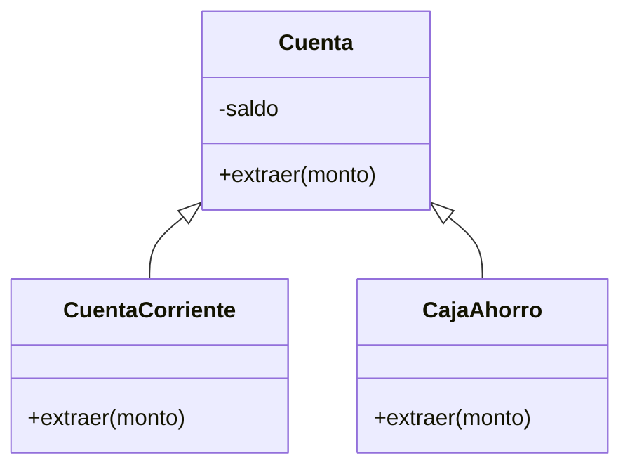

# Índice

[TOC]

# Smalltalk y Pharo

## Introducción

Smalltalk en sí es un sistema, no solo un lenguaje de programación que se compone por

* Un IDE (visual age, pharo, squeak, dolphin, etc.)
* Lenguaje 100% orientado a objetos (smalltalk)
* Imagen
* Máquina virtual

El desarrollo en este sistema esta basado en imágenes y **no** en archivos, como hacen otros lenguajes. Esto quiere decir que vamos a tener una única imágen en donde vamos a escribir el código de las clases que hacen al sistema y lo vamos a guardar todo ahí. 

## Imágen y máquina virtual

Desde el punto de vista físico en smalltalk podemos hablar de la máquina virtual y la imágen. 

* En *Pharo* la máquina virtual es CogVM, y básicamente nos permite "levantar" la imágen que se encuentra en disco. Cuando nosotros escribimos el código lo hacemos en esta máquina virutal y no en un editor de texto (como otros lenguajes).
* La imágen por su parte es una imágen del sistema serializada a disco (un archivo físico) que contiene todos los objetos del sistema en formato binario (bytecode) y se compone de tres archivos
  * miimagen.image --> contiene bytecode
  * miimagen.changes --> debe tener el mismo nombre que el .image, contiene un registro de los cambios que se fueron haciendo a partir del .sources
  * PharoV10.sources --> contiene el código fuente original

¿Cómo se relacionan estros archivos? El código que nosotros escribimos en lenguaje smalltalk (código fuente) se va guardando en el archivo .changes. Cuando grabamos el trabajo que hicimos lo que esta pasando es que el código se compila y se traduce a bytecode, y eso es lo que se almacena en .image

Es muy importante estar seguros de tener siempre los 2 archivos porque si bien la máquina virtual puede interpretar sin problemas el archivo .images lo que va a pasar es que el código que vamos a estar viendo en el sistema no va a ser el que escribimos nosotros. Al no encontrar el código fuente la máquina virtual va a decompilar el bytecode para ofrecernos el código que lo originó, pero no va a ser el que nosotros hayamos escrito: los comentarios que hayamos puesto no van a estar (porque al compilar se descartan) y los nombres de las variables probablemente sean otros.

# Principios de la POO

## Encapsulamiento

No importa el cómo, sino el qué.

Cada objeto es responsable de responder a los mensajes que recibe, sin que quien le envía el mensaje tenga que saber cómo lo hace. Algunas ventajas de aplicar encapsulamiento son

* Puede haber implementaciones alternativas para una misma operación
* En el futuro podemos cambiar una implementación por otra (ambas correctas) sin afectar el servicio que utiliza el cliente

Una consecuencia del aplicar esto es un **principio de diseño** que se conoce como "Tell don't ask" donde se explica que los objetos deben manejar su propio comportamiento sin que nosotros manipulemos su estado desde afuera.

## Polimorfismo

El polimorfismo se refiere a la propiedad por la que es posible enviar **mensajes sintácticamente iguales** a objetos de tipos distintos. El único requisito que deben cumplir los objetos que se utilizan de manera polimórfica es saber responder al mensaje que se les envía.

El polimorfismo nos sirve para muchas cosas:

1. Para eliminar condicionales, en programación estrucutrada podríamos tener algo como

```java
if (cantante == "gallo") {
    print("Co co roroo\n");
} else if (cantante == "canario") {
    print("Pi pi ri pii\n");
} else if (cantante == "La Mona Jiménez") {
    print("Quien se ha tomado todo el vino\n"
} else if (cantante == "Madonna") {
    print("Like a virgin\n");
} else if (cantante == "Abel Pintos") {
    print("Dame la llave\n");
}
```

Y llevandolo a POO podemos hacer exactamente de la siguiente manera



```java
Collection<Cantante> cantantes;
cantantes.add(new LaMona());
cantantes.add(new Canario());
cantantes.add(new Gallo());
cantantes.add(new Madonna());
cantantes.add(new AbelPintos());
for (Cantante cantante : cantantes) {
   cantante.cantar();
}
```

2. Definir una interfaz que reduce el acoplamiento, aumenta la reutilización y hace que el código sea más fácil de leer y mantener

3. Ocultar detalles de implementación al interactuar con un grupo de clases diferentes a través de una interfaz común. Esto significa que podemos tener una clase que interactúa con muchos objetos que heredan* de la misma clase madre a través de los métodos que comparten estos objetos. Dichos métodos se conocen como la interfaz.

   *Nota: no necesariamente tiene que haber herencia*

La clave para utilizar el polimorfismo es **crear objetos**. Podemos seguir los siguientes pasos

1. Identificar y aislar comportamientos

   

2. Utilizar los nuevos objetos

   Acá vemos que Cocina no tiene ni idea de qué cocinero está cocinando (no sabe qué instancia de cocinero tiene asignada) y por eso se pueden incorporar nuevos cocineros en el futuro **sin modificar el código de Cocina**. El código de arriba funciona porque todas las instancias *entienden el mismo mensaje* -> polimorfismo.

## SOLID

**SOLID** es un acrónimo acuñado por Robert C.Martin para definir los cinco principios básicos de la programación orientada a objetos: Single responsibility, Open-closed, Liskov substitution, Interface segregation y Dependency inversion

### SRP (Single Responsability Principle)

*Debe existir una única razón para modificar una clase*

El principio de responsabilidad única se basa en que cada clase o método sólo debe hacer una cosa, sencilla y concreta. Si un objeto tiene una sola responsabilidad, va a ser más fácil de mantener.

Se viola este principio cuando por ejemplo en un mismo método se mezcla la lógica de negocio con la lógica de presentación, para ésto es mejor dos clases distintas, cada una para manejar su responsabilidad.

### OCP (Open Close Principle)

Está relacionado con el SRP que vimos en el punto anterior. El principio Open/Closed dice que una clase/método debe estar abierto a extensiones pero cerrado a modificaciones. Esto quiere decir que se debe poder cambiar el comportamiento sin modificar el código (herencia y polimorfismo).

Si el día de mañana el cliente solicita un nuevo requisito para algo que ya está desarrollado, el comportamiento de esa clase debería ser extendido, nunca modificado. En caso contrario la probabilidad de que encontrarnos con daños colaterales es muy alta.

### LSP (Liskov Substitution Principle)

*Las clases heredadas deben poder ser utilizadas a través de su clase madre sin la necesidad de que el usuario sepa la diferencia* - Robert Martin 

Este principio recibe el nombre por la persona que lo enunció: Barbara Liskov. Plantea que cualquier subclase debería poder sustituirse por la clase padre sin que se rompa todo. En otras palabras, se tiene que poder almacenar en una variable de un determinado tipo referencias a objetos subclases del tipo de la variable. 

La aplicación más elemental de este principio es el chequeo de la relación "es un", osea que la subclase sea un subconjunto de la clase madre. La idea general es que las clases base no deben tener comportamientos que dependan de las clases derivadas (o incluso de su existencia).

Para esto las subclases tienen que *comportarse* de la misma manera que la superclase, además de chequear la relación "es un" deberíamos chequear también la relación "se comporta como". 

En java teniendo el siguiente modelo



Podríamos escribir lo siguiente:

```java
Cuenta cuenta = new CuentaCorriente();
```

Y debería seguir funcionando todo.

Los consecuencias de aplicar el principio son:

* Las precondiciones de un método no pueden ser más estrictas en una subclase de lo que son en su ancestro
* Las postcondiciones de un método no pueden ser más laxas en una subclase de lo que son en su ancestro
* Las invariantes de una clase deben ser al menos los mismos de la clase ancestro
* Un método debe lanzar los mismos tipos de excepciones que en la clase ancestro, o a lo sumo excepciones derivadas de aquellas

### ISP (Interface Segregation Principle)

Está relacionado con el SRP. Este principio plantea que es mejor definir una serie de métodos abstractos a través de una serie de interfaces para que implementen nuestras clases. Cada interfaz debe tener una única responsabilidad, y es preferible tener muchas interfaces con pocos métodos que una sola con muchos métodos.

El objetivo de esto es poder reutilizar las interfaces en otras clases, porque cada clase va a implementar las interfaces que necesite y use y **ninguna más**.

### DIP (Dependency Inversion Principle)

*Se debe depender de las abstracciones y no de las implementaciones.*

El objetivo de este principio es desacoplar las clases de nuestro desarrollo, es decir que una clase pueda funcionar por sí sola, sin depender de otras. Es muy difícil porque en todo diseño al final existe un acoplamiento, pero lo ideal sería evitarlo lo más posible porque un sistema altamente acoplado es muy difícil de mantener.

# Excepciones

Una excepción es un objeto que se utiliza para comunicar una situación excepcional desde un entorno que la detecta al ámbito desde el cual fue invocado.

En general se provocan cuando no se cumple una precondición interrumpiendo el flujo del programa, Lo que pasa es que muchas veces en el punto que surja el error no vamos a saber qué decisión tomar, y ahí es donde hay que elevar a un contexto superior para que resuelva el inconveniente.

La idea al trabajar con excepciones es aislar el código que se usa para tratar problemas del que podemos llamar código básico. De esta manera nuestro código va a quedar más limpio y vamos a estar brindando una forma unificada de reportar errores.

# Metodología TDD

TDD o Test-Driven Development es una metodología de programación que consiste en escribir primero las pruebas unitarios, y luego el código. Los pasos más detallados serían:

1. Escribir el test (que no va a compilar)
2. Escribir el código mínimo y necesario para que compile
3. Correr el test para verificar que falla
4. Agregar el código mínimo posible para que el test pase
5. Correr el test para verificar que pase
6. Refactorizar (mantener la firma y funcionalidad mejorando el código para que quede más cheto)
7. Agregar más pruebas


Algunas de las ventajas que tiene esta práctica son:

1. Vamos construyendo el código de manera limpia
2. Evitamos escribir código innecesario
3. Al solucionar los problemas en el momento el desarrollo es ágil. Hay un flujo continuo de tareas, análisis y correcciones por lo que conseguimos un trabajo más rápido y con menos errores.

[Acá](https://drive.google.com/file/d/1vgJtdNr0iZWrW3smR1tCzSGJtK9c_iCL/view) dejo un ejemplp donde Pablo Massuh resuelve el ejercicio de la puerta (en clase) esta metodología con Smalltalk y Pharo.

Y [acá](https://www.youtube.com/watch?v=UBH8vskKC24&list=PLeYmeZsyThALveQWz1lrGbqA1PS2NGOtw&index=5) dejo otro un poco más viejo en donde arman una clase Pila.

# Extreme Programming


Es un conjunto de prácticas centradas en la programación que lleva al extremo las buenas prácticas de programación.

## Prioridades

1. Código autodocumentado
2. Embebida en el código (comentarios)
3. Pruebas unitarias
4. Otras pruebas automatizadas

Menor valoración a UML, documentos externos, etc. (aunque no se descartan)

## Pruebas

1. Hacer pruebas todo el tiempo
2. Desarrollo dirigido por las pruebas (TDD)
3. Se diseña antes de codificar
4. Integración continua como práctica: evita que sea cada vez más complicado integrar código de varias fuentes

## Diseño

1. El diseño evoluciona junto con la programación
2. Lo hacen los propios programadores
3. Minimizar la documentación (para eso está el código)

## Calidad del código

1. Revisar código todo el tiempo
2. Pair-programming (revisar de a dos)
3. Refactorizaciones

## Desarrollo incremental

1. Hacer micro-iteraciones
2. Diseñar una pequeña porción, codificarla y probarla
3. Preocuparse sólo por lo que se está haciendo

## Simplicidad

1. Hacer las cosas lo más simples posibles, la complejidad dificulta refactorizaciones
2. No implementar cosas que no se sabe si van a servir o no (el 80% de los casos no sirve)

# UML

El **L**enguaje de **M**odelado **U**nificado es una notación que nos sirve para documentar el software. Fue creado para unificar la representación de procesos, diagramas y esquemas.

## Diagramas de Clase


**Asociación:** una clase *tiene* una (o varias) instancia(s) de otra

**Agregación:** ejemplo de estudiantes y escuela -> Si la escuela se destruye, los alumnos siguen existiendo

**Composición:** ejemplo de pulpo y sus tentáculos -> Si el pulpo se destruye, los tentáculos también (otra forma de pensarlo es que no puede existir un tentáculo sin el pulpo)

**Dependencia:** una clase *usa / conoce* una (o varias) instancia(s) de otra. Es más débil que la asociación, en este caso la clase **no tiene como atributo** una instancia de la otra, simplemente la utiliza en alguno de sus métodos.

**Herencia:** para que una clase herede de otra tiene que cumplir la relación *es un...*

**Implementación de una interfaz:** la clase a la izquierda implementa la interfaz a la que apunta. 

### Ejemplo


En plantuml sería:

```plantuml
class Bicicleta {
    - precioPorUnSoloDia
    - precioPorDia
    + calcularDeudaPor(periodo)
    + deudaDiaria()
}
class Cliente {
    + agregarAlquiler(alquiler)
    + saldoAPagar()
}
abstract Alquiler {
    + agregarItem(item)
    + deuda()
}
class AlquilerDiario {
    + deuda()
}
class AlquilerPorPeriodo {
    + deuda()
}

Alquiler <|.. AlquilerDiario
Alquiler <|.. AlquilerPorPeriodo
Alquiler o--right Bicicleta
Cliente *--right Alquiler
```

*Nota: para tirar facha con el diagrama de clase poner*

```plantuml
hide circle
skinparam classAttributeIconSize 0
skinparam backgroundColor [COLOR]
skinparam RoundCorner 10
skinparam Shadowing true

skinparam class {
    ArrowColor [COLOR]
    BackgroundColor [COLOR]
    BorderColor [COLOR]
}
```

Los métodos y atributos de clase se subrayan, por ejemplo:


Acá `ultimoNumero` es un atributo de clase. En plantUML para subrayar podemos usar el tag `<u> ... </u>`

## Diagramas de Secuencia

Es un diagrama dinámico que muestra como los objetos se envían mensajes entre sí a lo largo del tiempo para resolver un problema. 


* Cada objeto se coloca arriba de una linea, llamada linea de vida. La misma puede tener un rectángulo cubriendola parcialmente para indicar que en ese momento el objeto está activo.
* Cada mensaje se escribe en forma horizontal entre la línea de vida del objeto que envía el mensaje y aquel que la recibe
* Si un objeto se envía un mensaje a sí mismo se puede dibujar como una flecha que vuelve sobre él mismo
* La terminación de un mensaje con varios envíos de mensajes anidados se puede indicar con una flecha de línea punteada (retorno). Si bien no es obligatorio a veces agrega claridad.

Un objeto con su respectiva clase:


Un objeto del que no nos interesa su clase:


Una instancia de la que sólo conocemos su clase:


### Ejemplo


En `TestCase` se instancia un objeto `Bicicleta` con un precio diario, luego un `AlquilerDiario` con la bicicleta y luego un `Cliente`. Con todos los objetos instanciados, se llama al mensaje `saldoAPagar()` de `Cliente` quien llama a `deuda() ` de `AlquilerDiario` quien a su vez llama a `deudaDiaria()` de `Bicicleta`. Con todo calculado se devuelve el saldoAPagar a `TestCase`

En plantuml sería:

```plantuml
create Bicicleta
TestCase -> Bicicleta : conPrecioDiario(precio)
participant "bici:Bicicleta" as Bicicleta
participant "alquiler:AlquilerDiario" as AlquilerDiario
participant ":Cliente" as Cliente
Bicicleta --> TestCase : unaBici
create AlquilerDiario
TestCase -> AlquilerDiario : crearAlquilerPara(unaBici)
create Cliente
TestCase -> Cliente : new
Cliente --> TestCase : unCliente
TestCase -> Cliente : agregarAlquiler(unAlquiler)
TestCase -> Cliente : saldoAPagar()
loop para cada alquiler
    Cliente -> AlquilerDiario : deuda()
    loop para cada bicicleta
        AlquilerDiario -> Bicicleta : deudaDiaria()
    end
end
Cliente --> TestCase : saldoAPagar
```

Para tirar facha con el diagrama de secuencia poner

```plantuml
skinparam RoundCorner 10
skinparam Shadowing true
skinparam ArrowColor [COLOR]
skinparam SequenceLifeLineBorderColor [COLOR]
skinparam SequenceLoopBackgroundColor [COLOR]

skinparam actor {
    BackgroundColor [COLOR]
    BorderColor [COLOR]
}

skinparam participant {
    Bound [COLOR]
    BackgroundColor [COLOR]
    BorderColor [COLOR]
}
```

# Cuando un diseño es malo

* **Rigidez:** dificultad de cambiar porque cada vez que se modifica algo se genera una secuencia interminable de cambios
* **Fragilidad:** cada cambio provoca problemas en partes del código que no tienen que ver con el mismo
* Se hace muy dificil descomponer el sistema en partes reutilizables
* El ciclo editar-compilar-probar lleva mucho tiempo
* **Complejidad innecesaria:** estrucutras de código que no se necesitan, aunque puedan servir en el futuro
* **Repetición innecesaria:** no se reutiliza sino que se copia-pega partes de código en varios lugares
* **Opacidad:** el programador se expresa (mediante el código) de formas ininteligibles

Hay otros problemas típicos de diseño que Martin Fowler llama *"malos olores"* que los buenos diseñadores detectan enseguida con su intuición. Algunos de los *olores* más usuales son:

* Ciclos muy anidados (que deberían convertirse en métodos)
* Código duplicado (que causa modificaciones paralelas)
* Métodos complejos o muy largos
* Clases con varias responsabilidades o muy largas
* Abundancia de sentencias `switch` of `if/else` anidadas
* Largas secuencias de llamadas sucesivas a métodos
* Demasiados chequeos de referencias nulas
* Clases anémicas que no tienen comportamiento, sólo atributos, getters y setters
* Atributos no encapsulados
* Métodos que usan más características de otras clases que de la suya propia
* Uso de tipos primitivos o básicos para conceptos diversos
* Comentarios que explican el código difícil de leer

# Cosas a tener en cuenta para el diseño de una buena solución

1. Encapsular todo lo posible
2. Pensar *de quién es la responsabilidad*
3. Revisar métodos largos
4. Revisar clases con getters y setters para _tooodos_ los atributos
5. Revisar uso de condicionales
6. Revisar uso de tipos standard (primitivos, string, etc) como parámetros de entrada y retorno

*Nota: recomendaciones hechas por Pablo Massuh el martes previo a la entrega del TP1*

# Patrones de diseño

Un patrón es una solución no trivial a un problema de un determinado contexto. En particular los **patrones de diseño** nos indican cómo utilizar clases y objetos de formas conocidas y estudiadas. Es el concepto de reutilización llevado al diseño, presentado orignalmente por Erich Gamma y otros tres autores, conocidos como "la banda de los 4" (GoF). 

La idea es usar patrones que otros descubrieron para aplicarlos en los futuros desarrollos, porque la adopción de los mismos puede traernos grandes ventajas:

* Estructuras de diseño probadas previamente
* Soluciones alternativas a las más frecuentes simples o ingenuas
* Descripción de soluciones en base a combinaciones de patrones usuales
* Fácil interpretación de colaboraciones ya conocidas
* Facilidad de separar los aspectos que cambian de los que no
* Mayor nivel de abstracción
* Introducen un lenguaje común para referirse a formas de construir software, elevando el nivel de abstracción de la conversación. Esto favorece la enseñanza, el aprendizaje y el trabajo en grupos

## Creacionales

### Factory Method

Este patrón pretende encapsular la creación de objetos de determinados tipos, todos descendientes de una misma clase abstracta o interfaz. De esta manera el cliente puede obtener una referencia a un objeto del cual no conoce su clase, sino sólo una de sus interfaces posibles.

La implementación general del patrón Factory Method consiste en mantener una jerarquía de clases creadoras, paralela a la jerarquía de clases a crear.


Los principios que satisface este patrón son:

* Inversión de dependencia, ya que los clientes sólo conocen la interfaz del objeto que crean
* Bajo acoplamiento entre clientes y objetos creados

**Abstract Factory**

La intención es tener interfaces que nos permitan agrupar objetos sin tener que especificar la clase concreta a la cual pertenecen. Para esto vamos a necesitar que la Fábrica Abstracta defina un Método de Fábrica por producto. A su vez cada Método de Fábrica tiene que encapsular el *nuevo* operador y el producto concreto.


### Factory class

No es uno de los patrones descriptos por GoF pero algunos autores lo consideran una forma simplificada del Abstract Factory, que sí forma parte de los patrones canónicos. Consiste en encapsular en una clase la creación de objetos.

Los principios que satisface este patrón son:

* Inversión de dependencia, ya que los clientes sólo conocen la interfaz del objeto que crean
* Bajo acoplamiento entre clientes y objetos creados

## Estructurales

### Composite

Este patrón nos sirve para aquellas ocasiones en que un objeto se puede representar como un conjunto de objetos de su mismo tipo o familia de tipos.


En el diagrama anterior podemos ver como los componentes y los contenedores están representados por una interfaz común. Cada instancia de una clase derivada de `FiguraContenedor` contiene una referencia a una instancia de una clase descendiente de `FiguraAbstracta`, como consecuencia de esto cada objeto `FiguraCompuesta` puede contener referencas a `Elipse`, `Polígono` e incluso otra `FiguraCompuesta` (de forma recursiva, ya que todos descienden de `FiguraAbstracta`).

Los principios que satisface este patrón son:

* OCP, ya que podemos usar y ampliar clases de componentes sin necesidad de modificarlas
* Sustitución, al tratar los compuestos también como componentes, cuando es esperable que lo sean

### Decorator

Este patrón es bastante complejo y a continuación vamos a ver una forma simplificada. Este patrón busca agregar comportamiento a uno o más métodos de una clase en forma dinámica, respentando simultáneamente el OCP. Supongamos que tenemos la siguiente jerarquía de clases:


Y que ahora deseamos contar cada vez que se llame al método `dibujar()` en cualquier clase de las de la jerarquía. La solución con el patrón Decorator va a ser envolver los objetos de `Elipse` o de `Poligono` de modo tal que al método dibujar se le agregue comportamiento que incremente un contador:


Luego, la instanciación de las clases habría que hacerlas así: `Figura figura = new Contador(new Elipse());` lo que nos lleva a ¿cómo podemos evitar que el programador cliente cree instancias de `Elipse` y `Poligono` sin envolverlas en una instancia de `Contador`? Y ahí es donde entran los patrones de creación: podemos encapsular la creación de figuras y allí envolver cada objeto en un Decorator.

El diagrama de clase de la versión *no simplificada* sería:


Los principios que satisface este patrón son:

* OCP, ya que no necesitamos modificar las clases para agregar comportamiento a los métodos
* Encapsulamiento de lo que varía, que en este caso son los decoradores que se agregan
* Inversión de dependencia, ya que los clientes programan contra la interfaz más alta de la jerarquía
* Extensión sin herencia de clases, ya que una solución más rígida pudo haber sido heredar comportamiento y agregarlo por redefinición, con el costo de que no podría hacerse en forma dinámica

## Comportamiento

### Iterador

Son objetos que recorren colecciones sin ser parte de las mismas. La idea es trabajar con un objeto que posea el conocimiento sobre cómo recorrer determiando tipo de colección de forma ta; que los clientes de ese objeto no necesiten conocer la estrucutra interna de la colección.


Con esto logramos que la colección mantenga su única responsabilidad de almacenar objetos y nos queda una interfaz más simple y consistente.

Los principios que satisface este patrón son:

* Única responsabilidad y alta cohesión, ya que tanto la colección como el iterador tienen un único comportamiento: almacenar objetos en el primer caso y recorrer el agregado en el segundo
* Inversión de dependencia al utilizarse los iteradores por su interfaz

### Template

La idea de este patrón es definir una clase abstracta con un método plantilla que contiene la lógica principal de un algoritmo, pero que delega en ciertos métodos la implementacion de cuestiones particulares (se redefinen en las clases descendientes).

Un buen uso del patrón exige que el método plantilla sea no redefinible, si no fuera así estaríamos tergiversando la intención del patrón porque permitiríamos un marco mutable.


Los principios que satisface este patrón son:

* Encapsulamiento de lo que varía, en este caso los métodos redefinibles
* OCP ya que se utiliza funcionalidad de la clase plantilla y se la modifica, pero sin modificarla
* Alta o baja granularidad, según la conveniencia

### Observer

La idea principal es manejar las situaciones en las cuales dos objetos (mutuamente desacoplados) que necesitan actuar al unísono, de modo tal que cuando uno cambie de estado, el otro sea notificado y pueda responder con cierto comportamiento preestablecido. Al priemr objeto se lo llama obserbado o sujeto y al segundo observador. Habitualmente se admite que existan varios observadores por sujeto sin que éste deba saberlo o varíe en algo su comportamiento.

Hay tres maneras posibles de notificación

1. **Pull:** es la más común, se basa en que el sujeto solo avisa a sus subscriptores que su estado cambió sin enviar información adicional. Esto exige que, luego, los observadores le pidan su estado (o los datos que le interesen) al sujeto. Es un modelo flexible y simple aunque un puede haber cierta ineficiencia derivada del doble llamado.
2. **Push:** consiste en que el sujeto envía la información sobre lo que cambió y el nuevo estado del emisor, de modo que no sea necesario que los observadores le pidan el estado más tarde. Este modelo es flexible pero probablemente los observadores reciban mayor información que la necesaria.

3. **Basado en eventos:** observadores se suscriben a listas diferentes, por temas, y las notificaciones les llegan ante ciertos cambios de estado para una lista y ante otros para otras listas. Este modelo reduce mucho la cantidad de información que viaja pero su implementación es bastante más compleja.

Los diagramas de secuencia y clase del **push** quedarían:


Los principios que satisface este patrón son:

* Bajo acoplamiento entre sujeto y observadores
* OCP, ya que se pueden agregar observadores de tipos diferentes sin cambiar la clase del sujeto observado
* Única responsabilidad mantiendo separados a sujeto y observadores
* Inversión de dependencia, porque los observadores se conocen por su interfaz

### Command simplificado

Este patrón nos sirve para encapsular un método o un conjunto de ellos en un objeto, de modo tal que luego se los pueda usar en todas las ocasiones en que se usan los objetos.

Los objetos `Command` son objetos sin estado, ya que su razón de ser no tiene que ver con almacenar dato alguno, sino solamente implementar uno u otro método. En definitiva es un patrón simple que busca encapsular un método en un objeto.


Los principios que satisface este patrón son:

* Encapsulamiento de lo que varía, en este caso los posibles métodos a aplicar
* Inversión de dependencia, porque los distintos métodos están ocultos tras su interfaz
* Extensión sin herencia de clases, ya que el acceso a los métodos encapsulados se hace por delegación

El diagrama de la versión *no simplificada* sería:


### Strategy

Este patrón encapsula varios algoritmos alternativos en diferentes clases y se ofrece una interfaz única para acceder a la funcionalidad ofrecida. La elección del algortimo se vuelve transparente para el cliente, pudiendo depender del objeto e incluso variar en el tiempo. Esto permite, además, simplificar la clase cliente y reducir las estructuras de desición en el mismo.


Los principios que satisface este patrón son:

* Encapsulamiento de lo que varía, al mantener los algoritmos en una jerarquia aparte
* Inversión de dependencia, porque utilizamos interfaces para acceder a los algoritmos
* Extensión sin herencia de clases, al implementar las estrategias mediante una delegación

### Chain of Responsability

Este patrón consiste en armar varias estrategias que se aplicarán de forma sucesiva


Un ejemplo puntual podría ser estrategias de un TaTeTi contra la computadora:


Los principios que satisface este patrón son:

* Encapsulamiento de lo que varía, al mantener los algoritmos en una jerarquia aparte
* Extensión sin herencia de clases, al implementar las estrategias mediante delegación

### State

La idea de este patrón es permitir que un objeto altere su comportamiento cuando cambia su estado interno, de modo tal que parezca cambiar su clase.


Los principios que satisface este patrón son:

* Encapsulamiento de lo que varía, en este caso los estados
* Inversión de dependencia, porque se accede a los estados mediante su interfaz

## Pendientes

### Visitor y Double Dispatching

Double Dispatch no es un patrón esitrctamente hablando, es una técnica que descubrió y presentó Dan Ingalls con el nombre de "polimorfismo múltiple". Visitor por otra parte sí es un patrón presentado por GoF que usa como implementación típica Double Dispatch.

Visitor se usa cuando los objetos entre los cuales debemos hacer el despacho doble están en jerarquías distintas. Por ejemplo si tenemos el siguiente diagrama de clases:


Podríamos tener en `CajaAhorro`:

```java
protected double porcentajeImpuestoPorDeposito() {
    return this.getTitular().alicuotaCajaAhorro(this);
}
```

Y en `CuentaCorriente`:

```java
protected double porcentajeImpuestoPorDeposito() {
    return this.getTitular().alicuotaCuentaCorriente(this);
}
```


### Adapter

### Facade

### Proxy

### MVC

### Separación en capas

### Singleton


